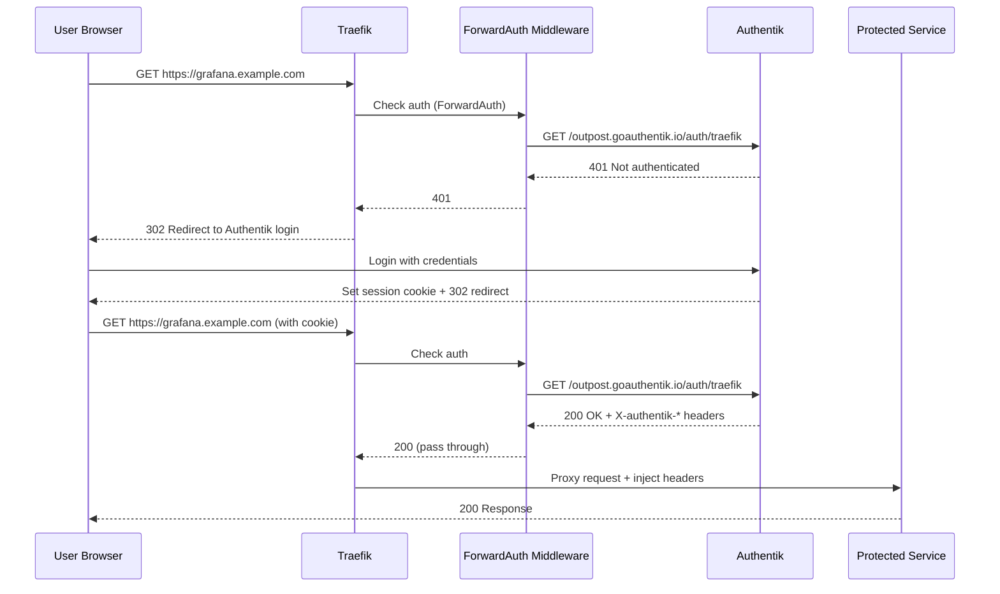
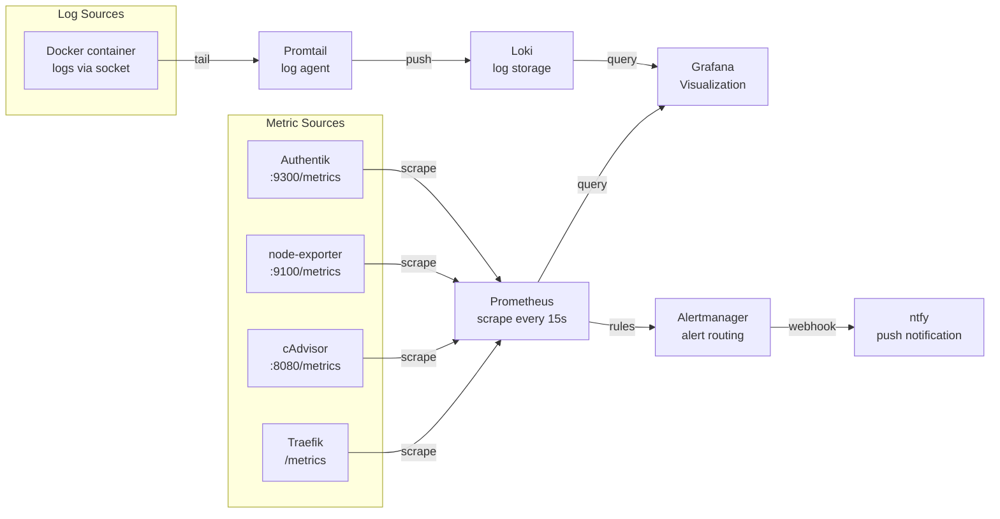

# HomeLab Stack -- Complete Architecture Document

> Version: v1.0 | Updated: 2026-03-18 | Commit: d758304
> Repo: https://github.com/illbnm/homelab-stack

## Table of Contents

1. [Project Overview](#project-overview)
2. [Architecture Diagram (Mermaid)](#architecture-diagram)
3. [Network Topology](#network-topology)
4. [Service Dependency Map](#service-dependency-map)
5. [SSO Auth Flow](#sso-auth-flow)
6. [Observability Data Flow](#observability-data-flow)
7. [Stack Details](#stack-details)
8. [Startup Order](#startup-order)
9. [Domain Planning](#domain-planning)
10. [Scripts Reference](#scripts-reference)

---

## Project Overview

| Metric | Value |
|--------|-------|
| Total Stacks | 12 |
| Total Services | 38 |
| Bounty Pool | $2,340 USDT |
| Core Stack | Docker Compose + Traefik v3 + Authentik + Prometheus + Loki |
| CN Network Support | Mirror acceleration + Aliyun/Huawei fallback sources |
| Min Hardware | 8 cores / 16 GB RAM / 100 GB SSD |
| Rec Hardware | 16 cores / 32 GB RAM / 500 GB SSD |

---

## Architecture Diagram

```mermaid
flowchart TB
    subgraph Internet["External Access"]
        User(["User Browser"])
        VPNClient(["WireGuard Client"])
    end

    subgraph Entry["Entry Layer"]
        Traefik["Traefik v3.1.6
Reverse Proxy + HTTPS
:80 / :443"]
        WG["WireGuard wg-easy
VPN :51820/udp"]
        DNS["AdGuard Home
DNS Filter :53"]
    end

    subgraph AuthLayer["Auth Layer -- SSO Stack"]
        Authentik["Authentik 2024.8.3
OIDC Provider
ForwardAuth Middleware
auth.DOMAIN"]
        AuthPG[("PostgreSQL 16
Authentik DB")]
        AuthRedis[("Redis 7
Authentik Sessions")]
    end

    subgraph DBLayer["Database Layer -- databases Stack"]
        PG[("PostgreSQL 16
homelab-postgres
Gitea/Vaultwarden/Outline/Nextcloud")]
        Redis[("Redis 7
homelab-redis
Outline/Nextcloud cache")]
        MariaDB[("MariaDB 11.4
homelab-mariadb
BookStack")]
    end

    subgraph ObsLayer["Observability -- monitoring Stack"]
        Prometheus["Prometheus v2.54.1
Metrics Scraper"]
        Grafana["Grafana 11.2.0
Dashboard + SSO
grafana.DOMAIN"]
        Loki["Loki 3.2.0
Log Aggregation"]
        Promtail["Promtail 3.2.0
Log Collector"]
        Alertmanager["Alertmanager v0.27.0
Alert Routing"]
        cAdvisor["cAdvisor v0.49.1
Container Metrics"]
        NodeExp["node-exporter v1.8.2
Host Metrics"]
    end

    subgraph MediaLayer["Media Stack"]
        Jellyfin["Jellyfin 10.9.11
media.DOMAIN"]
        Sonarr["Sonarr 4.0.9
sonarr.DOMAIN"]
        Radarr["Radarr 5.11.0
radarr.DOMAIN"]
        qBit["qBittorrent 4.6.7
qbt.DOMAIN"]
        Prowlarr["Prowlarr 1.24.3
prowlarr.DOMAIN"]
    end

    subgraph ProdLayer["Productivity Stack"]
        Gitea["Gitea 1.22.3
git.DOMAIN"]
        Vault["Vaultwarden 1.32.0
vault.DOMAIN"]
        Outline["Outline 0.80.2
docs.DOMAIN"]
        BookStack["BookStack 24.10
books.DOMAIN"]
    end

    subgraph StorageLayer["Storage Stack"]
        Nextcloud["Nextcloud 29.0.9
nextcloud.DOMAIN"]
        MinIO["MinIO 2024-11-07
minio.DOMAIN"]
        FileBrowser["FileBrowser v2.31.2
files.DOMAIN"]
    end

    subgraph AILayer["AI Stack"]
        Ollama["Ollama 0.3.14
ollama.DOMAIN"]
        OpenWebUI["Open WebUI v0.3.35
ai.DOMAIN"]
        SD["Stable Diffusion CPU
sd.DOMAIN"]
    end

    subgraph HALayer["Home Automation Stack"]
        HA["Home Assistant 2024.11.3
ha.DOMAIN"]
        NodeRED["Node-RED 3.1.14
nodered.DOMAIN"]
        MQTT["Eclipse Mosquitto 2.0.20
:1883/:9001"]
        Z2M["Zigbee2MQTT 1.41.0
z2m.DOMAIN"]
    end

    subgraph NetworkLayer["Network Stack"]
        AdGuard["AdGuard Home v0.107.55
adguard.DOMAIN"]
        NPM["Nginx Proxy Manager 2.11.3
npm.DOMAIN"]
        WireGuard["WireGuard wg-easy
vpn.DOMAIN"]
    end

    subgraph NotifLayer["Notifications Stack"]
        ntfy["ntfy 2.11.0
ntfy.DOMAIN"]
        Apprise["Apprise API 1.9
apprise.DOMAIN"]
    end

    subgraph DashLayer["Dashboard Stack"]
        Homarr["Homarr 0.15.3
dashboard.DOMAIN"]
        Homepage["Homepage v0.9.10
home.DOMAIN"]
    end

    User -->|HTTPS| Traefik
    VPNClient -->|WireGuard UDP| WG
    WG --> Traefik

    Traefik -->|ForwardAuth check| Authentik
    Traefik --> Grafana
    Traefik --> Gitea
    Traefik --> Vault
    Traefik --> Outline
    Traefik --> BookStack
    Traefik --> Nextcloud
    Traefik --> Jellyfin
    Traefik --> Ollama
    Traefik --> OpenWebUI
    Traefik --> HA
    Traefik --> ntfy
    Traefik --> Homarr
    Traefik --> AdGuard
    Traefik --> NPM

    Authentik --- AuthPG
    Authentik --- AuthRedis

    Grafana -->|OIDC| Authentik
    Outline -->|OIDC| Authentik
    BookStack -->|OIDC| Authentik
    Gitea -->|OAuth2| Authentik

    Gitea --- PG
    Vault --- PG
    Outline --- PG
    Outline --- Redis
    BookStack --- MariaDB
    Nextcloud --- PG
    Nextcloud --- Redis

    Prometheus -->|scrape| cAdvisor
    Prometheus -->|scrape| NodeExp
    Prometheus -->|scrape| Traefik
    Prometheus -->|scrape| Authentik
    Promtail -->|push| Loki
    Loki --> Grafana
    Prometheus --> Grafana
    Prometheus --> Alertmanager

    NodeRED --> MQTT
    Z2M --> MQTT
    HA --> MQTT
    HA --> NodeRED

    OpenWebUI --> Ollama
    Apprise --> ntfy
```




## Network Topology

```
+------------------+     +---------------------------+
|   Host Machine   |     |   Docker Networks         |
|                  |     |                           |
|  :80/:443  ------+---> | proxy (bridge)            |
|  :53 tcp/udp-----+---> |   All services visible    |
|  :51820/udp------+---> |   to Traefik              |
|  :1883/:9001-----+---> |                           |
|                  |     | databases (bridge)        |
|                  |     |   homelab-postgres:5432   |
|                  |     |   homelab-redis:6379      |
|                  |     |   homelab-mariadb:3306    |
+------------------+     +---------------------------+
```

### Network Rules

| Network | Created by | Joined by |
|---------|------------|----------|
| `proxy` | base stack | ALL services |
| `databases` | databases stack | databases, productivity, storage, sso (own PG/Redis) |

**Startup prerequisite**: `base` stack (creates `proxy` network) and `databases` stack (creates `databases` network) MUST be started before any other stack.

---

## Service Dependency Map

```
base (Traefik) ─────────────────────────────┐
    └─ creates: proxy network               │ required by ALL
                                            │
databases ──────────────────────────────────┤
    └─ creates: databases network           │
    └─ homelab-postgres:5432 ───────────────┼─> gitea, vaultwarden, outline, nextcloud
    └─ homelab-redis:6379 ──────────────────┼─> outline, nextcloud
    └─ homelab-mariadb:3306 ────────────────┼─> bookstack
                                            │
sso (Authentik) ────────────────────────────┤
    └─ own postgres + redis (isolated)      │
    └─ OIDC provider ───────────────────────┼─> grafana, outline, bookstack
    └─ OAuth2 provider ─────────────────────┼─> gitea
    └─ ForwardAuth middleware ──────────────┼─> traefik (all routes)
                                            │
monitoring ─────────────────────────────────┤
    └─ prometheus scrapes ──────────────────┼─> traefik, cadvisor, node-exporter, authentik
    └─ loki receives ───────────────────────┼─> promtail (docker logs)
    └─ grafana datasources: prometheus+loki │
    └─ alertmanager receives ───────────────┼─> prometheus alerts
                                            │
home-automation ────────────────────────────┤
    └─ mosquitto (MQTT broker) ─────────────┼─> zigbee2mqtt, node-red, home-assistant
    └─ node-red flows ──────────────────────┼─> home-assistant, mqtt, ntfy
    └─ zigbee2mqtt ─────────────────────────┼─> mosquitto
                                            │
ai ─────────────────────────────────────────┤
    └─ open-webui depends_on ───────────────┼─> ollama (health check)
    └─ ollama API ──────────────────────────┼─> open-webui (http://ollama:11434)
                                            │
notifications ──────────────────────────────┤
    └─ apprise ─────────────────────────────┼─> ntfy (push notifications)
```

---

## SSO Auth Flow



### OIDC Integration per Service

| Service | SSO Method | Scope | Auto-provision |
|---------|-----------|-------|---------------|
| Grafana | Generic OAuth2 | openid profile email | Yes (role via groups) |
| Outline | OIDC | openid profile email | Yes |
| BookStack | OIDC | openid profile email | Yes |
| Gitea | OAuth2 provider | openid profile email | Yes |
| Portainer | ForwardAuth | N/A | Manual first login |
| Vaultwarden | ForwardAuth (admin only) | N/A | N/A |

---

## Observability Data Flow



### Alert Rules (config/prometheus/rules/homelab.yml)

| Rule | Threshold | Severity |
|------|-----------|----------|
| InstanceDown | >1min | critical |
| HighCPU | >85% for 5min | warning |
| HighMemory | >90% for 5min | warning |
| DiskAlmostFull | >85% | warning |
| ContainerRestarting | >3 restarts/15min | warning |

---

## Stack Details
### base
| Service | Image | URL |
|---------|-------|-----|
| Traefik | traefik:v3.1.6 | traefik.DOMAIN |
| Portainer | portainer-ce:2.21.4 | portainer.DOMAIN |
| Watchtower | containrrr/watchtower:1.7.1 | -- |

Config: config/traefik/traefik.yml (prod), traefik.local.yml (dev)

### sso
| Service | Image | URL |
|---------|-------|-----|
| Authentik Server | goauthentik/server:2024.8.3 | auth.DOMAIN |
| Authentik Worker | same | -- |
| PostgreSQL | postgres:16-alpine | -- |
| Redis | redis:7-alpine | -- |

CN mirror: swr.cn-north-4.myhuaweicloud.com/ddn-k8s/ghcr.io/goauthentik/server:2024.8.3

### databases
| Service | Container Name | Port | Used By |
|---------|---------------|------|---------|
| PostgreSQL | homelab-postgres | 5432 | Gitea, Vaultwarden, Outline, Nextcloud |
| Redis | homelab-redis | 6379 | Outline, Nextcloud |
| MariaDB | homelab-mariadb | 3306 | BookStack |

### monitoring
| Service | Image | URL |
|---------|-------|-----|
| Prometheus | prom/prometheus:v2.54.1 | prometheus.DOMAIN |
| Grafana | grafana/grafana:11.2.0 | grafana.DOMAIN |
| Loki | grafana/loki:3.2.0 | -- |
| Promtail | grafana/promtail:3.2.0 | -- |
| Alertmanager | prom/alertmanager:v0.27.0 | alerts.DOMAIN |
| cAdvisor | gcr.io/cadvisor:v0.49.1 | -- |
| node-exporter | prom/node-exporter:v1.8.2 | -- |

### productivity
| Service | Image | URL | DB | SSO |
|---------|-------|-----|----|----|
| Gitea | gitea/gitea:1.22.3 | git.DOMAIN | homelab-postgres | OAuth2 |
| Vaultwarden | vaultwarden/server:1.32.0 | vault.DOMAIN | homelab-postgres | ForwardAuth |
| Outline | outlinewiki/outline:0.80.2 | docs.DOMAIN | homelab-postgres+redis | OIDC |
| BookStack | linuxserver/bookstack:24.10 | books.DOMAIN | homelab-mariadb | OIDC |

Networks: proxy + databases

### storage
| Service | Image | URL |
|---------|-------|-----|
| Nextcloud | nextcloud:29.0.9 | nextcloud.DOMAIN |
| MinIO | minio/minio:2024-11-07 | minio.DOMAIN |
| FileBrowser | filebrowser/filebrowser:v2.31.2 | files.DOMAIN |

Networks: proxy + databases
Nextcloud: POSTGRES_HOST=homelab-postgres, REDIS_HOST=homelab-redis

### media
| Service | Image | URL |
|---------|-------|-----|
| Jellyfin | jellyfin/jellyfin:10.9.11 | media.DOMAIN |
| Sonarr | linuxserver/sonarr:4.0.9 | sonarr.DOMAIN |
| Radarr | linuxserver/radarr:5.11.0 | radarr.DOMAIN |
| qBittorrent | linuxserver/qbittorrent:4.6.7 | qbt.DOMAIN |
| Prowlarr | linuxserver/prowlarr:1.24.3 | prowlarr.DOMAIN |

Key env: MEDIA_PATH, DOWNLOAD_PATH. Setup: scripts/setup-media.sh

### ai
| Service | Image | URL |
|---------|-------|-----|
| Ollama | ollama/ollama:0.3.14 | ollama.DOMAIN |
| Open WebUI | open-webui:v0.3.35 | ai.DOMAIN |
| Stable Diffusion | sd-webui-docker:cpu-v1.10.1 | sd.DOMAIN |

Open WebUI depends_on: ollama (healthy). OLLAMA_BASE_URL=http://ollama:11434

### home-automation
| Service | Image | URL |
|---------|-------|-----|
| Home Assistant | homeassistant/home-assistant:2024.11.3 | ha.DOMAIN |
| Node-RED | nodered/node-red:3.1.14 | nodered.DOMAIN |
| Mosquitto | eclipse-mosquitto:2.0.20 | :1883/:9001 |
| Zigbee2MQTT | koenkk/zigbee2mqtt:1.41.0 | z2m.DOMAIN |

MQTT flow: Zigbee2MQTT -> Mosquitto -> Home Assistant/Node-RED

### network
| Service | Image | URL |
|---------|-------|-----|
| AdGuard Home | adguard/adguardhome:v0.107.55 | adguard.DOMAIN |
| Nginx Proxy Manager | jc21/nginx-proxy-manager:2.11.3 | npm.DOMAIN |
| WireGuard | weejewel/wg-easy:latest | vpn.DOMAIN |

Key env: WG_HOST, WG_PASSWORD, WG_DEFAULT_DNS

### notifications
| Service | Image | URL |
|---------|-------|-----|
| ntfy | binwiederhier/ntfy:v2.11.0 | ntfy.DOMAIN |
| Apprise API | caronc/apprise:1.9 | apprise.DOMAIN |

Integrations: Alertmanager/Node-RED -> ntfy; Apprise -> multi-channel

### dashboard
| Service | Image | URL |
|---------|-------|-----|
| Homarr | ghcr.io/ajnart/homarr:0.15.3 | dashboard.DOMAIN |
| Homepage | gethomepage/homepage:v0.9.10 | home.DOMAIN |

---

## Startup Order

1. `stack-manager.sh start base` -- creates proxy network
2. `stack-manager.sh start databases` -- creates databases network + PG/Redis/MariaDB
3. `stack-manager.sh start sso` + `./scripts/setup-authentik.sh`
4. All other stacks in any order
   Or use `bash install.sh` for guided setup

---

## Domain Planning

| Subdomain | Service | Stack |
|-----------|---------|-------|
| traefik.DOMAIN | Traefik Dashboard | base |
| portainer.DOMAIN | Portainer | base |
| auth.DOMAIN | Authentik | sso |
| grafana.DOMAIN | Grafana | monitoring |
| prometheus.DOMAIN | Prometheus | monitoring |
| alerts.DOMAIN | Alertmanager | monitoring |
| git.DOMAIN | Gitea | productivity |
| vault.DOMAIN | Vaultwarden | productivity |
| docs.DOMAIN | Outline | productivity |
| books.DOMAIN | BookStack | productivity |
| nextcloud.DOMAIN | Nextcloud | storage |
| minio.DOMAIN | MinIO | storage |
| files.DOMAIN | FileBrowser | storage |
| media.DOMAIN | Jellyfin | media |
| sonarr.DOMAIN | Sonarr | media |
| radarr.DOMAIN | Radarr | media |
| qbt.DOMAIN | qBittorrent | media |
| prowlarr.DOMAIN | Prowlarr | media |
| ollama.DOMAIN | Ollama | ai |
| ai.DOMAIN | Open WebUI | ai |
| sd.DOMAIN | Stable Diffusion | ai |
| ha.DOMAIN | Home Assistant | home-automation |
| nodered.DOMAIN | Node-RED | home-automation |
| z2m.DOMAIN | Zigbee2MQTT | home-automation |
| adguard.DOMAIN | AdGuard Home | network |
| npm.DOMAIN | Nginx Proxy Manager | network |
| vpn.DOMAIN | WireGuard | network |
| ntfy.DOMAIN | ntfy | notifications |
| apprise.DOMAIN | Apprise | notifications |
| dashboard.DOMAIN | Homarr | dashboard |
| home.DOMAIN | Homepage | dashboard |

---

## Scripts Reference

| Script | Purpose |
|--------|---------|
| install.sh | Guided first-time setup wizard |
| scripts/stack-manager.sh | Start/stop/restart/status any stack |
| scripts/setup-env.sh | Generate .env from template |
| scripts/setup-authentik.sh | Configure OIDC apps in Authentik |
| scripts/setup-media.sh | Configure Sonarr/Radarr/Prowlarr via API |
| scripts/cn-pull.sh | Pull images via CN mirror |
| scripts/backup.sh | Full backup: volumes + databases |
| scripts/backup-databases.sh | Database-only backup (PG + Redis) |
| scripts/check-deps.sh | Verify prerequisites |
| scripts/test-stacks.sh | Health check all stacks |

---

## CN Network Adaptation

Set CN_MODE=true in .env to enable mirror sources.
Use scripts/cn-pull.sh to pull gcr.io/ghcr.io images via DaoCloud/Aliyun.
Authentik CN mirror: swr.cn-north-4.myhuaweicloud.com/ddn-k8s/ghcr.io/goauthentik/server

---

*Generated by HomeLab Stack project. See https://github.com/illbnm/homelab-stack*
